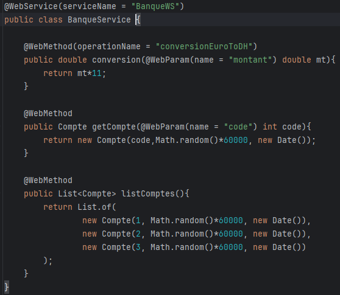
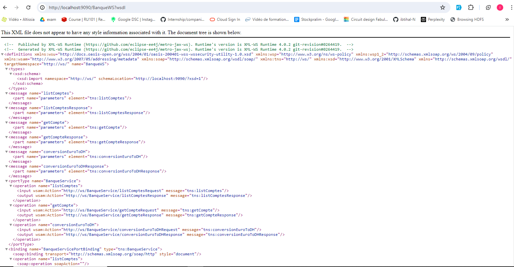
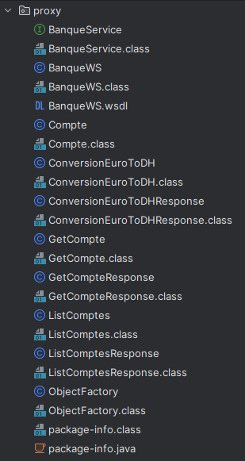
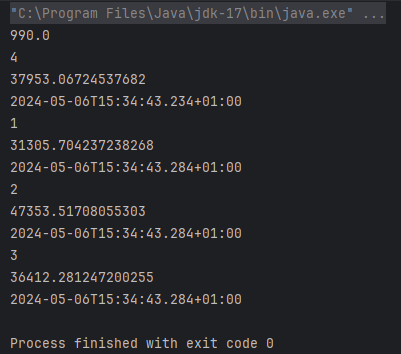

<h3>Web Service SOAP</h3>
<h5> • Convertir un montant de l’euro en DH</h5>
<h5> • Consulter un Compte</h5>
<h5> • Consulter une Liste de comptes</h5>

<h5> Consulter et analyser le WSDL avec un Browser HTTP</h5>

<h5>Créer un Client SOAP Java</h5>

